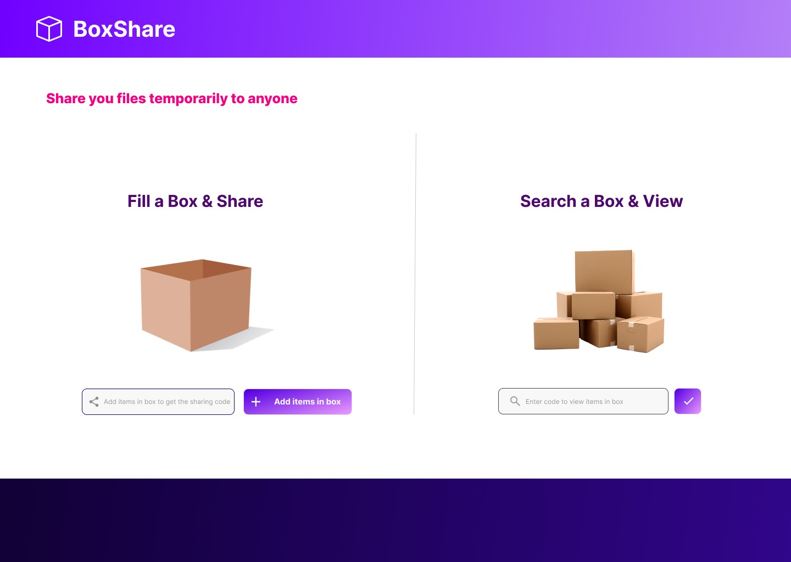

# BoxShare

BoxShare is a temporary file-sharing platform where users can upload, share, and search files using a unique Box ID. Anyone with the Box ID can search for and view the files, but the data is only accessible during the active session. Users can also add new files to a shared Box, making it a quick and efficient way to temporarily share files with others.

# Features

File Upload: Users can upload files to a shared Box.
File Search and View: Files can be searched and viewed using a unique Box ID.
Temporary Storage: Files remain accessible only for the duration of the current session.
Collaborative Sharing: Multiple users can add files to the same Box for easy sharing.

  
## Table of Contents

- [Installation](#installation)
- [Usage](#usage)
- [Features](#features)
- [Contributing](#contributing)
- [License](#license)
  
## Installation

To get a local copy up and running, follow these steps:

1. Clone the repository:

   ```bash
   git clone https://github.com/yourusername/BoxShare.git
   ```

2. Navigate to the project directory:

   ```bash
   cd BoxShare
   ```

3. Open the `index.html` file in your browser to start the application.

## Usage

1. Launch the web app by opening `index.html` in your preferred browser.
2. Use the interface to upload and download files.

## Folder Structure

- `index.html`: Main entry point of the application.
- `index_ui_final.html`: The finalized UI for the application.
- `res/`: Resource files used by the application.
- `src/`: Source code for the backend logic.

## Example Image




## Contributing

Contributions are welcome! If you'd like to contribute, please fork the repository and create a pull request with a description of your changes.

1. Fork the project
2. Create your feature branch: `git checkout -b feature/your-feature`
3. Commit your changes: `git commit -m 'Add some feature'`
4. Push to the branch: `git push origin feature/your-feature`
5. Open a pull request

## License

This project is licensed under the MIT License - see the [LICENSE](LICENSE) file for details.

